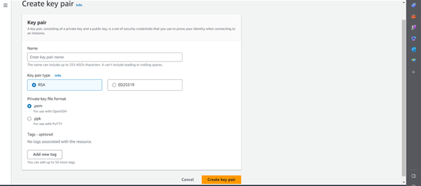

# AWS – Week 5
### **DevOps**

`What is DevOps`

DevOps can be described as a way of working that brings together teams involved in developing software and managing its operations. It focuses on improving collaboration, communication, and efficiency between these teams to deliver software faster and with higher quality.

DevOps acts as a bridge that connects the people who build software (developers) with the people who manage its deployment and operations (operations teams). It encourages them to work closely together throughout the entire software development process. 

The main purpose of DevOps is to break down barriers and create a culture of collaboration, where developers and operations teams work as a unified group. This collaboration leads to faster and more frequent releases of software updates, allowing organizations to respond quickly to customer needs and market demands.

` Some of the advantages of DevOps`

1. **Faster Time to Market**

2. **Increased Collaboration and Communication** 

3. **Enhanced Software Quality**

4. **Improved Stability and Reliability**

5. **Increased Efficiency and Productivity**

6. **Scalability and Flexibility**

### `Differences between AWS and Azure`

### **AWS**
```
-	Not necessary to use 
-	By Default IP address is dynamic meaning it changes it everytime VM restarts.
-	Launch instance to create VM	
```
### **Azure**
```
-	Everything has to go to Resource Group
-	By Default the Ip address is static meaning Public ip address remains same when VM starts
-	Create VM 
```

## **AWS Introduction**
Amazon Web Services (AWS) is a cloud computing platform that offers a wide range of services, including EC2 (Elastic Compute Cloud). EC2 allows you to launch and manage virtual servers in the cloud.


### **How to launch an EC2 instance**

1. **Sign in to the AWS Management Console**


2. **Navigate to EC2**: From the AWS Management Console, search for and select "EC2" to access the EC2 Dashboard.


3. **Select Instance and choose Lauch Instance**


4. **Choose Amazon Machine Image**


5. **Select Instance Type**


6. **Configure Network Settings and Security Groups**


7. **Configure Storage**


### How to create ssh keypair on AWS

1. Search for "key pair" on search and select key pair (EC2 feature)


2. Select "create key pair" on top right 
   
3. Give a key pair name

4. Select the key pair type (RSA)

5. Select the format of key file (.pem)

6. Create the key file. 

 

#### `After you create the key pair it will generate the keypair and will download the .pem file consist of private key with the .pem extension.` 


### How to SSH into an EC2 Instance

1. Locate the Instance: From the EC2 dashboard, find the EC2 instance you want to connect. 


2. Open Git Bash terminal


3. Change Directory (cd into home directory)


4. Set Permissions on Key Pair- Chmod 400


5. Copy the path and enter into the Terminal.


### How to terminate an EC2 instance

1. Sign in to the AWS 


2. Navigate to EC2


3. Locate the Instance


4. Select the Instance


5. Terminate Instance


6. Confirm Termination


7. Check Termination Status


## Script for the app


`#!/bin/bash`

`1. update source list`
```
sudo apt update -y
```
`2. upgrade all the packages and installs them in the kernal`
```
sudo apt upgrade -y
```
`3. install nginx`
```
sudo apt install nginx -y
```
`4. Start nginx on boot`
```
sudo systemctl enable nginx
```
`5. start nginx`
```
sudo systemctl start nginx
```
`6. restart nginx`
```
sudo systemctl restart nginx
```
`7. enable nginx - auto runs on startup`
```
sudo systemctl enable nginx
```
`8. add proxy command`
```
sudo sed -i 's|try_files $uri $uri/ =404;|proxy_pass http://localhost:3000;|' /etc/nginx/sites-available/default
```
`9. restart nginx`
```
sudo systemctl restart nginx
```
`10. enable nginx - auto runs on startup`
```
sudo systemctl enable nginx
```
`11. download node js`
```
curl -sL https://deb.nodesource.com/setup_12.x | sudo -E bash -
```
`12. add in env`
```
export DB_HOST=mongodb://63.33.164.191:27017/posts
```
`13. install node js`
```
sudo apt install nodejs -y
```
`14. update source list`
```
sudo apt update -y
```
`15.  install pm2`
```
sudo npm install -g pm2
```
`16. git clone app`
```
git clone https://github.com/jungjinggg/tech241_sparta_app app2
```
`17. get into app folder`
```
cd ~/app2/app
```
`18. install node js inside folder`
```
npm install -y
```

`19. start app`
```
pm2 start app.js --name "sparta app"
```

## **Script to run DB**

#!/bin/bash

`1. Update the system`
```
sudo apt update -y
```
`2. Upgrade the system`
```
sudo apt upgrade -y
```
`3. Install the correct version of MongoDB (version 3.2.x)`
```
wget -qO - https://www.mongodb.org/static/pgp/server-3.2.asc | sudo apt-key add -
```
`4. Source List`

```
echo "deb http://repo.mongodb.org/apt/ubuntu xenial/mongodb-org/3.2 multiverse" | 
```
`5. Source List`
```
sudo tee /etc/apt/sources.list.d/mong$sudo apt update -y
```

`6. Install mongo db`
```
sudo apt-get install -y 
```
`7. Downloads the specific verison of mongo db`
```
mongodb-org=3.2.20 mongodb-org-server=3.2.20 mongodb-org-shell=3.2.20 mongodb-org-mongos=3.2.20$
```
`8. Configure MongoDB to accept connections from the app VM by changing the bindIP to 0.0.0.0`
```
sudo sed -i 's/bindIp: 127.0.0.1/bindIp: 0.0.0.0/g' /etc/mongod.conf
```
`9. Start and enable (when you reboot your VM mongo db also starts up) MongoDB`
```
sudo systemctl start mongod
```
```
sudo systemctl enable mongod
```

`After Running Both Script and working`


