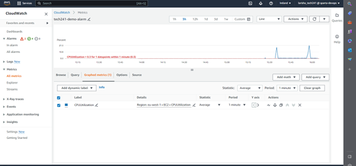

# User Data

User data in AWS enables you to automate and customize the setup of EC2 instances by running scripts or commands during instance launch.

How to create User Data on AWS
1. **Sign in to the AWS Management Console**

2. **Navigate to EC2**: From the AWS Management Console, search for and select "EC2" to access the EC2 Dashboard.

3. **Select Instance and choose Lauch Instance**

4. **Choose Amazon Machine Image**

5. **Select Instance Type**

6. **Configure Network Settings and Security Groups**

7. **Configure Storage**

8. **Go to Advanced setting and go to User data and paste the DB script then Launch Instance**

# Amazon Machine Image (AMI)

AMI is snapshot of the disk by making a copy to recreate a virtual machine.  By making an image this disk then can be used to recreate the first VM so its virtually identical copy of a VM. 

### Why make AMI?

Creating an AMI in AWS allows you to capture the state of an EC2 instance, providing a reusable template for launching identical instances. AMIs offer benefits such as reproducibility, faster deployment, improved disaster recovery capabilities.

- It costs less than having a Virtual Machine Running.

- It is only using the disk space.

### How to create AMI?

1. Go to Instance

2. Select the Instance you want to use

3. Select action on top right.

4. Select Image and templete and choose create Image option

5. Add image name and description

6. Add new tag and add key and value and Launch Instance. 
   

## IP Address

Public IP address and Private IP Address:

Private IP Address: 

Private ip address allows you to access the virtual machines and communicate directly though the Netwrok Interface Controller and does not require it to go through Network Security Group (NSG)

Public IP Address: 

Public IP address needs Network Security Group to communicate with another VM which are in the same Virtual Network. 

# Cloud Monitoring

## How to set uo an Alarm for Monitoring resources in AWS.

1. Go to the "View Metrics" on CPU Utilisation on Monitoring platform.

2. Set the custom refresh interval to 1 minute so that the metrics are updated frequently.
   
3. Look for the "Create Alarm" and click on it to initiate the alarm creation process.

4. In the alarm configuration panel, select a period equal to or greater than 1 minute. 
   
5. Set the conditions to "static" since you want a fixed threshold value.
   
6. Specify the threshold value you want to use, for example, > 0.3 and Proceed to the next step.

7. Create a new topic for the alarm by providing a name.
   
8. Insert your email address as the recipient for the alarm notifications.
   
9. Create the topic to confirm the subscription.

10. Review the subscription confirmation details and ensure they are correct. 

# CPU usage alarm

1. Access your dashboard or monitoring platform.
   
2. Select the alarm you created.
   
3. Look for a red line on the graph, indicating the threshold you assigned to the alarm.
   
4. Run a script/command that will generate a spike in CPU usage
   
5. Monitor the graph on your dashboard and wait for the CPU usage to exceed the threshold you set.

   
6. Once the threshold is crossed, the monitoring system should detect the spike and trigger the alarm.
   
7. Then we recevied email associated with the alarm configuration and CPU spike.

